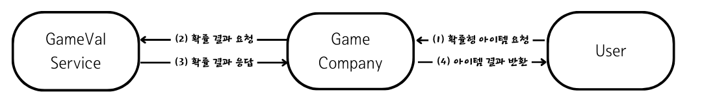

# GameVal
- 게임사, 유저, gameVal 서비스의 3자 불신뢰 상태에서의 확률의 검증을 가능케 하는 서비스입니다.
- 시스템 설계와 동시성을 염두에 두고 개발했습니다.

## 서비스 소개
- 기존 게임의 확률형 아이템의 확률은 게임사의 서버에서 도출하는 것으로 되어있었습니다. 
  그러나 이 방법은 게임사가 고지된 확률대로 유저에게 아이템을 지급하는 지 매우 증명하기 어렵고, 또 조작에 매우 취약합니다. 
  이 프로젝트는 그런 상황을 타파하고자 만들어진 서비스입니다. 

## 서비스 구조 소개

1. 유저가 자신의 UUID와 '요청 시각'을 담은 요청을 게임사에게 전송합니다.
2. 게임사는 유저의 요청이 정상적인지 검증한 후에 정보를 GameVal 서비스에 전송합니다.
3. GameVal service는 유저의 요청에 담긴 정보를 바탕으로 선택된 난수 값과 결과를 게임사에게 전송합니다.
4. 게임사는 GameVal service에서 받은 정보를 재구성하여 유저에게 결과를 전송하는 동시에, 전송한 결과를 UUID와 함께 익명으로 웹사이트에 게시합니다.

## 기술 사용 스택
- Spring Boot, Spring Data JPA, Spring Security
- Mysql, DynamoDB, Redis

## 참여 인원 

|                                                            Backend                                                             |                                                             Backend                                                              |
|:------------------------------------------------------------------------------------------------------------------------------:|:--------------------------------------------------------------------------------------------------------------------------------:|
|  |  |
|                                                [김시우](https://github.com/seate)                                                 |                                                [변해광](https://github.com/haebyun)                                                 |
|                                                      서비스 기획, random 로직 작성                                                      |                                                         회원, 확률 테이블 로직 작성                                                         |

## 프로젝트 후기
### [GameVal 프로젝트 진행 후기 - 김시우](https://develop-the-seate.vercel.app/gameval)
